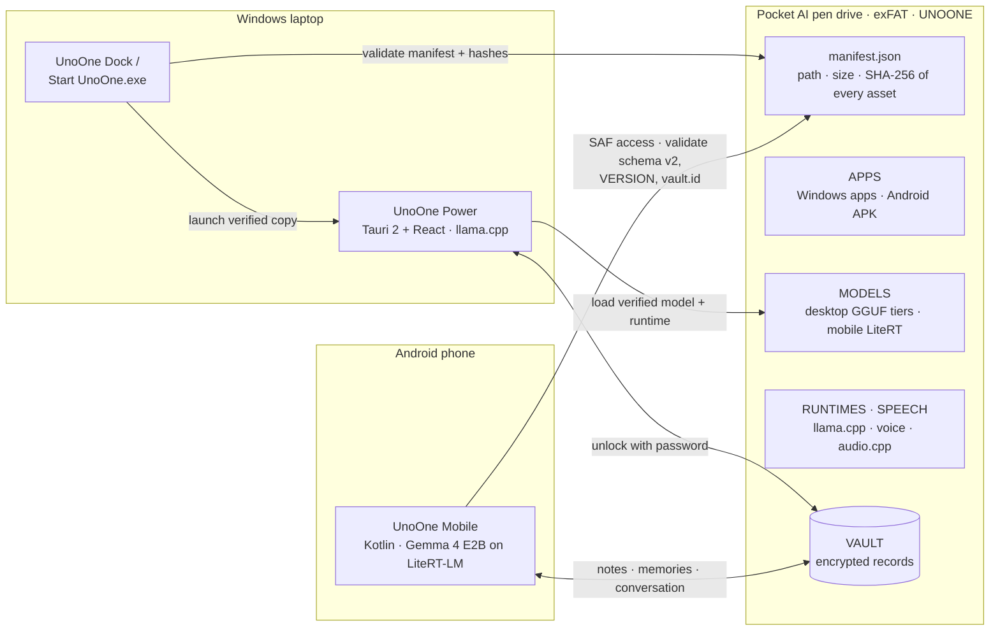
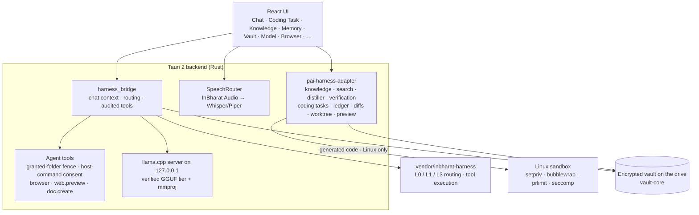
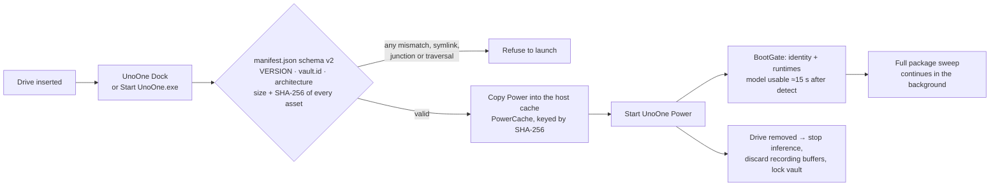
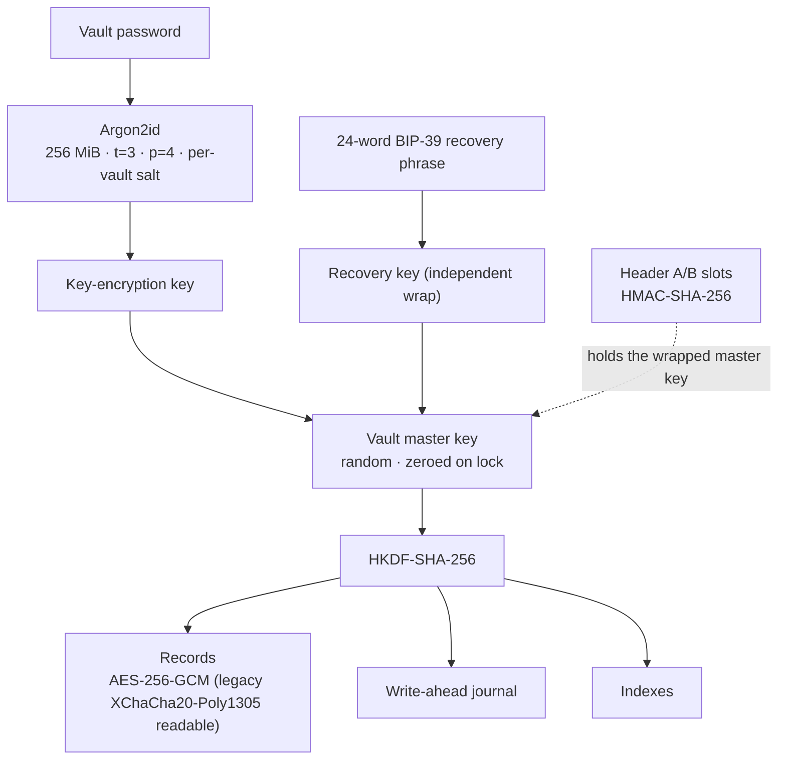
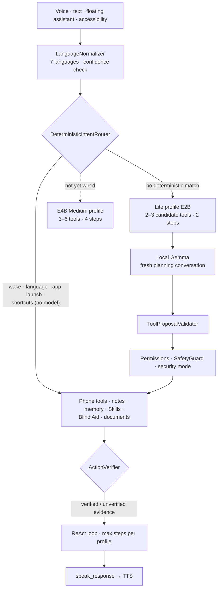
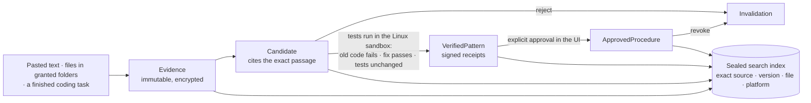

<p align="center">
  
</p>

<h1 align="center">UnoOne Pocket AI (PAI)</h1>

<p align="center"><b>Private AI on a pen drive — two host platforms, one encrypted vault, zero cloud.</b></p>

<p align="center">
  <a href="https://github.com/inbharatai/PAI.V2/actions/workflows/desktop-ci.yml"></a>
  <a href="https://github.com/inbharatai/PAI.V2/actions/workflows/pocket-ai-windows.yml"></a>
  <a href="https://github.com/inbharatai/PAI.V2/actions/workflows/android-ci.yml"></a>
  <a href="https://github.com/inbharatai/PAI.V2/actions/workflows/mobile-protection.yml"></a>
  <a href="https://github.com/inbharatai/PAI.V2/actions/workflows/distribution-ci.yml"></a>
</p>

> **Patent pending** — Indian provisional application **202631102427** (filed 2026-08-25). See [PATENT.md](PATENT.md).

## What it is

Pocket AI is the physical UnoOne pen drive. Its models, runtimes, applications,
identity and encrypted vault live on that removable device; Windows and Android
are only **hosts** for it. The host disk is never the canonical copy, and no
data or inference goes to a cloud.



| | UnoOne Mobile | UnoOne Power |
|---|---|---|
| **Platform** | Android 9+ | Windows desktop (the Rust workspace also builds and unit-tests on Linux and macOS in CI; no macOS app yet) |
| **Model** | Gemma 4 E2B (LiteRT-LM); an E4B profile is defined but not yet loaded by the app | Gemma 4 12B / E4B / E2B Q4 GGUF, RAM-tiered (llama.cpp) |
| **UI** | Jetpack Compose | Tauri 2 + React 19 |
| **Storage** | SQLCipher Room cache → USB vault | RAM → USB vault |
| **Voice** | Sherpa-ONNX STT/TTS | InBharat Audio (Qwen3-ASR / omnivoice) with Whisper/Piper as the explicit fallback |
| **Eyes-free** | TalkBack, Blind Aid, camera OCR | Screen reader, high contrast, OCR, camera describe + narration |

The release identity is not a drive letter, volume label or USB VID/PID: every
host validates `manifest.json`, `VERSION`, `VAULT/identity/vault.id`, the
declared architecture and every required asset hash before use.

## What it does

### UnoOne Mobile (Android)

- A local Gemma 4 E2B planner (hash-pinned) behind deterministic fast paths for wake words, language switches, app launches and accessibility shortcuts.
- A 42-tool registry with argument validation and risk classes (DIRECT / CONFIRM / STRONG_CONFIRM / blocked) byte-synced in CI with `packages/tool-contracts/tools.v1.json`; the model only ever sees a few candidate tools per task.
- Verified outcomes: the model may announce success only when the app has independently verified the action.
- Offline speech with language packs for 7 languages (en, hi, bn, ta, te, kn, ml), hands-free sessions and an offline wake word ("Uno").
- Phone actions and reviewable drafts (Calendar, WhatsApp, email) — UnoOne never presses the external app's final Send/Save.
- Blind Aid object detection, camera OCR and Read Screen; a master **Disable UnoOne** switch.
- With a Pocket AI attached and unlocked, the drive vault is the canonical store for notes, memories and conversation turns.

### UnoOne Power (Windows desktop)

- Chat with a local, manifest-verified Gemma model through the harness bridge (deterministic fast path / model / full agent loop) with audited tool calls and per-step transcripts.
- Agent tools inside a granted-folder fence: files, `doc.create` (PDF/DOCX/MD/TXT), workspace search and patch, `process.run` with per-session consent, sub-agents.
- A real browser lane over the WebView (logged-in sessions persist on that machine; credentials are never stored or typed by the agent) and live website preview.
- Persistent, encrypted conversation memory; document search; recording with enforced privacy levels; 15-language speech output.
- Fast startup (BootGate), RAM-aware model admission, launch from a SHA-256-verified host copy, and emergency vault lock on drive removal.

### Knowledge and coding workspace (new, 2026-10-07)

| Capability | Windows | Linux |
|---|---|---|
| Smarter chat context (greetings send no old history; named continuations pick one task) | ✅ | ✅ |
| Knowledge library in the vault: distill pasted text, encrypted search, review, consented export | ✅ | ✅ |
| Distill files from granted folders | — | ✅ |
| Verified learning (tests really run in a sandbox before a fix counts) | — | ✅ |
| Coding tasks: isolated edits, sandboxed checks, per-file review, apply to a separate folder, live preview | view-only | ✅ |
| Memory Explorer search | ✅ | ✅ |

Sandboxed execution is Linux-only by design; on Windows and macOS it refuses
before starting anything. These features are implemented and tested but have
not yet been run on Windows hardware. Details: [docs/FEATURES.md](docs/FEATURES.md).

## Status at a glance

| Area | Status |
|---|---|
| Physical Pocket AI | Integrity-verified prototype, reloaded 2026-10-04 (`verify-only`: valid, 0 failures). Not yet carrying the 2026-10-07 build |
| Desktop app | Agent lane, browser, preview, speech and memory live-verified on the staged drive (2026-09/10); CI green on Windows, Ubuntu and macOS |
| Windows apps | Power, Dock and Starter built together by CI with SHA-256 sums; launched from a digest-verified host copy |
| Android app | Android CI green; device evidence on Xiaomi 14 only; physical phone ↔ drive round trip pending |
| Vault | Argon2id + AES-256-GCM, hardened (Wave 1), Kotlin ↔ Rust cross-platform vectors proven in CI |
| Speech | InBharat Audio live matrix 19/19 on the staged drive (2026-09-15) |
| Knowledge + coding workspace | Implemented, independently reviewed, adapter suites pass with the real Linux sandbox; not yet on the drive |
| macOS | Rust workspace compiles and tests in CI; no macOS app, not tested on Mac hardware |

Full table, CI gates and dated test evidence: [docs/STATUS_AND_EVIDENCE.md](docs/STATUS_AND_EVIDENCE.md).

## Architecture

### Desktop (UnoOne Power)



### Launch and integrity (Windows)



### Vault encryption



Password-only (no account, no email, no cloud); tombstones propagate across
platforms; the Kotlin vault engine on Android uses the same contract, proven by
shared test vectors in CI.

### Android agent pipeline



More: [Android architecture](docs/ARCHITECTURE.md).

### Knowledge and verified learning



Nothing is promoted automatically, nothing leaves the machine, and there is no
export for model training.

### Safety

- Raw model output never executes tools directly.
- Desktop: SafetyGuard levels STANDARD / RELAXED / OFF with blocked actions; file
  tools are fenced to granted folders and `process.run` needs per-session consent;
  agent processes are terminated on lock, removal or exit. In the default
  full-access lane, confirmations are auto-approved, so desktop risk classes are
  labels rather than per-call dialogs.
- Android: risk classes from the CI-synced tool contract.

Full tables: [docs/SAFETY.md](docs/SAFETY.md).

## Quick start

### Android

```bash
git clone https://github.com/inbharatai/PAI.V2.git
cd PAI.V2/android-app/UnoOneAgent
./gradlew assembleDebug
adb install app/build/outputs/apk/debug/app-debug.apk
```

### Desktop

```bash
# Prerequisites: Rust (stable), Node 24 LTS; on Windows, MSVC Build Tools.
cd apps/desktop/src && npm ci && npm run build && cd ../../..   # the frontend is embedded at compile time
cargo build --release -p unoone-power -p unoone-dock-windows -p unoone-starter-windows
cargo run -p unoone-power                                       # or run Power from source
```

On a prepared Pocket AI, Windows users start at `Start UnoOne.exe`, which can
install UnoOne Dock for automatic opening on later insertions.

### Update a Pocket AI drive

When desktop code lands, only the three executables on the drive change.
`scripts/Stage-PocketAiDrive.ps1` stages them from a green **Pocket AI Windows
Bundle** CI artifact: it verifies the bundle's SHA-256 sums, backs up the current
executables to `RECOVERY\package-backups\<timestamp>`, copies the new ones, gates
frontend embedding, regenerates `manifest.json` and runs
`Start UnoOne.exe --verify-only`. Models, runtimes, `VAULT` and `CONFIG` are
untouched.

```powershell
# Quit UnoOne and back up VAULT first. From a checkout at the bundle's commit,
# with apps/desktop/src/dist built. For the desktop copy use
# -VaultRoot "$env:USERPROFILE\Desktop\UNOONE" instead of the drive letter.
powershell -ExecutionPolicy Bypass -File scripts\Stage-PocketAiDrive.ps1 `
    -VaultRoot "E:\" `
    -BundleDir "$env:USERPROFILE\Downloads\pocket-ai-windows-x86_64-<sha>"
```

## Drive layout

The drive is formatted exFAT (FAT32 cannot hold the 7.14 GiB 12B model).
Generated and checked by `scripts/New-UnoOneManifestV2.ps1`:

```
UNOONE/
├── Start UnoOne.exe          # on-drive fallback launcher
├── manifest.json             # strict schema v2
├── VERSION
├── APPS/WINDOWS/             # UnoOnePower.exe, UnoOneDock.exe
├── APPS/ANDROID/             # UnoOne.apk (tamper-evidence)
├── RUNTIMES/WINDOWS/         # CPU, CUDA, VULKAN (llama.cpp), VOICE, AUDIO
├── MODELS/MOBILE/            # Android E2B / E4B .litertlm
├── MODELS/DESKTOP/           # Gemma-12B (+ optional E4B / E2B), each with its mmproj
├── SPEECH/                   # config/ and models/ for InBharat Audio
├── VAULT/                    # identity/vault.id, header, records, indexes, journal, …
├── CONFIG/  RECOVERY/  UPDATES/  LOGS/
└── SOURCE/                   # optional: git archive of the staged commit
```

Discovery scans removable drives via WMI (falling back to probing `D:`–`P:` for
an `UNOONE` folder), then accepts a drive only after manifest validation.

## Project structure

```
PAI.V2/
├── android-app/UnoOneAgent/     # Android app, 16 Gradle modules (mobile-protected tree)
├── apps/desktop/                # UnoOne Power: src/ (React) and src-tauri/ (Rust, 27 modules)
├── apps/dock/windows/           # per-user insertion monitor
├── apps/starter/windows/        # on-drive fallback launcher
├── packages/                    # vault-core, pai-harness-adapter, capability/tool/speech contracts,
│                                # usb-manifest, recording, browser policy, Kotlin vault + contracts, …
├── vendor/inbharat-harness/     # universal Rust control plane
├── vendor/Inbharat-audiocpp/    # universal C++ speech plane
├── distribution/  installer-pwa/  web-runtime/  SPEECH/config/
├── scripts/                     # manifest/staging tools, contract sync checks, mobile baseline
└── docs/                        # features, status, architecture, safety, models, speech, evidence
```

## Tests and CI

```bash
cargo fmt --check && cargo test --workspace && cargo clippy --workspace -- -D warnings  # build apps/desktop/src first
UNOONE_REQUIRE_ISOLATION=1 cargo test -p pai-harness-adapter --lib   # Linux + bubblewrap: sandbox tests run for real
cd apps/desktop/src && npm ci && npm run build && npm run lint && npm run test:context
cd android-app/UnoOneAgent && ./gradlew test
```

CI on every relevant push: **Desktop CI** (Rust on Windows, Ubuntu and macOS;
frontend build; contract syncs; audio ctest; secret and artifact scans),
**Pocket AI Windows Bundle** (release build of the three apps, embedding gate,
voice smoke test), **Android CI**, **Distribution CI** and **Mobile
Protection**. On CI runners without bubblewrap the 50 Linux sandbox tests are
skipped with a visible warning. The desktop frontend Node suites
(`npm run test:*`) are not yet in CI. Android changes require a reviewed
re-baseline of `scripts/MOBILE_PROTECTED_TREE` ([policy](docs/MOBILE_GOLDEN_BASELINE.md)).

## Not production-ready yet

- A second Android device and broader OEM/API matrix; E4B wired into the Android load path and tested on device.
- Recorded-speech accuracy tests per language; a controlled Blind Aid corpus; human verification of audible speech and TalkBack.
- A sustained thermal/memory/battery and 50-task benchmark; Page Agent site qualification and prompt-injection testing.
- The physical phone ↔ drive ↔ desktop round trip and the Android boot auto-launch gates.
- Licence review, SBOM, signing key and signed APK — including an open item: the Android Indic TTS voices use Meta MMS models listed as CC-BY-NC-4.0 (non-commercial) ([model licences](docs/model-licenses.md)).
- Authenticode signing of the Windows executables and cryptographic manifest signing.
- The known crash on a mid-sweep device-removal IO error (hardware-conditional).
- Production catalogue signing, deployment, update and rollback testing (the installer PWA keeps downloads locked until a production key exists).
- Desktop: real-microphone recording and blind-aid camera/OCR on a sustained corpus; WDAC policy testing.
- The 2026-10-07 knowledge and coding workspace: staging on the drive, Windows hardware runs, local-model runs, the held-out acceptance suite, frontend suites in CI.
- A macOS app bundle and Mac hardware testing.

## Prohibitions

- ❌ No username/email login — password-only
- ❌ No plaintext storage on disk
- ❌ No cloud fallback without explicit approval
- ❌ No raw model output executing tools directly
- ❌ No weakening SafetyGuard or PageAgent
- ❌ Host disk is not canonical — USB is the single source of truth
- ❌ No mock data, no placeholder success states, no fake functionality
- ❌ No Android changes without a reviewed golden-baseline re-baseline
- ❌ No drive letter, volume label or VID/PID as identity — only manifest validation identifies Pocket AI
- ❌ No claiming features work without test evidence (command, exit code, OS, hardware, date, commit)
- ❌ No required external runtimes (Playwright, Tesseract, a separate Gemma download)
- ❌ No weakening Windows Application Control to make an unsigned build appear successful

## Documentation

- **[Features and internals](docs/FEATURES.md)** · **[Status and evidence](docs/STATUS_AND_EVIDENCE.md)**
- [Android build and validation](android-app/UnoOneAgent/README.md) · [Android architecture](docs/ARCHITECTURE.md) · [module walkthrough](docs/local-architecture.md) · [phone control](android-app/UnoOneAgent/phonecontrol/README.md)
- [Safety](docs/SAFETY.md)
- [Models](docs/MODELS.md) · [model acquisition](docs/MODEL_ACQUISITION_AND_DISTRIBUTION.md) · [model licences](docs/model-licenses.md) · [Blind Aid detector](docs/BLIND_AID_MODEL.md)
- [Speech architecture](docs/SPEECH_ARCHITECTURE.md) · [speech model qualification](docs/SPEECH_MODEL_QUALIFICATION.md) · [speech test evidence](docs/SPEECH_TEST_EVIDENCE.md) · [InBharat Audio integration](docs/INBHARAT_AUDIO_INTEGRATION.md)
- [Offline document skills](docs/OFFLINE_DOCUMENT_SKILLS.md) · [installer and distribution](docs/INSTALLER_AND_DISTRIBUTION.md) · [mobile golden baseline](docs/MOBILE_GOLDEN_BASELINE.md)
- [Connected-device validation](docs/DEVICE_VALIDATION_2026-07-17.md) · [device verification matrix](DEVICE_VERIFICATION.md) · [physical release record](docs/52_POCKET_AI_PHYSICAL_RELEASE_2026-07-29.md)
- [Universal capability plan and phase log](docs/UNIVERSAL_CAPABILITY_PLAN_2026-10-01.md)
- [Privacy policy](docs/play-review/privacy-policy.md) · [data safety](docs/play-review/data-safety.md)

## Patent notice

This software is claimed in Indian provisional patent application
**202631102427** (*Portable Host-Adaptive Private Artificial Intelligence System
with Device-Resident Canonical State*), filed 2026-08-25 with the Patent Office,
Kolkata (ref E106/3399/2026-KOL; TEMP/E1/113020/2026-KOL; docket 25913). The
complete specification is due by 2027-08-25. See [PATENT.md](PATENT.md). The
release identity, encrypted vault, local-only inference, capability-gated
harness execution and 22-scheduled-language Bharat speech runtime are among the
aspects covered by the application.

## License

Proprietary — Uni Guru Technologies LLP / InBharat.ai. Repository code, libraries, model weights, and speech artifacts may use different licences or usage terms. Review and preserve the notice attached to every component before redistribution.
