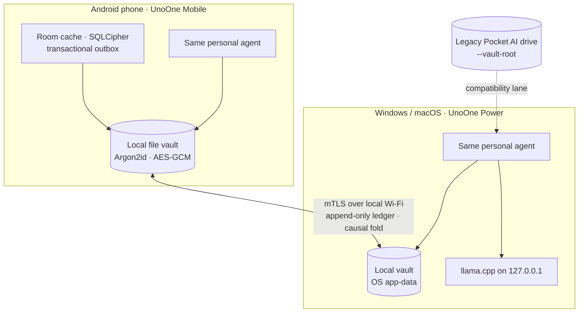
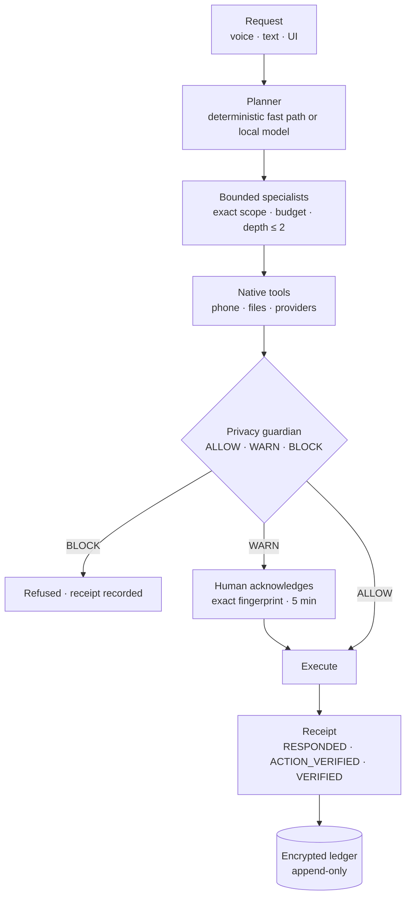
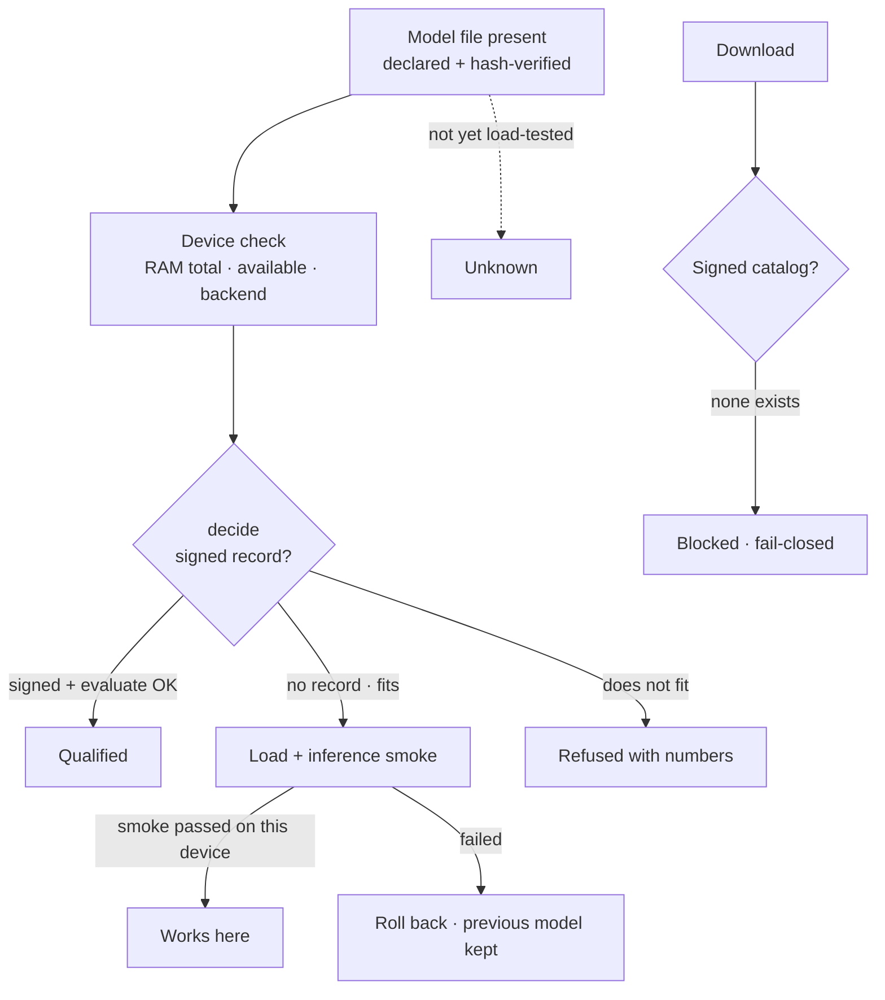
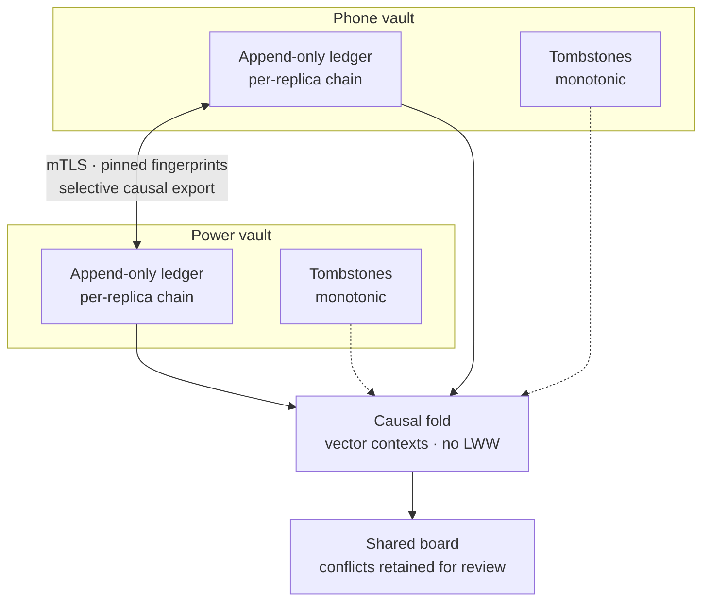

<p align="center">
  
  <br>
  <sub><i>Illustration, not a screenshot.</i></sub>
</p>

<h1 align="center">UnoOne Personal AI (PAI)</h1>

<p align="center"><b>One private personal agent on your phone and your PC — two independent encrypted vaults, local Wi-Fi sync, no cloud, no account, no pen drive required.</b></p>

<p align="center">
  <a href="https://github.com/inbharatai/PAI.V2/actions/workflows/desktop-ci.yml"></a>
  <a href="https://github.com/inbharatai/PAI.V2/actions/workflows/pocket-ai-windows.yml"></a>
  <a href="https://github.com/inbharatai/PAI.V2/actions/workflows/android-ci.yml"></a>
  <a href="https://github.com/inbharatai/PAI.V2/actions/workflows/mobile-protection.yml"></a>
  <a href="https://github.com/inbharatai/PAI.V2/actions/workflows/distribution-ci.yml"></a>
</p>

> **Patent pending** — Indian provisional application **202631102427** (filed 2026-08-25). See [PATENT.md](PATENT.md).

> **Read this first.** This README describes the integrated tree committed in October 2026. Every claim below carries one of three evidence labels:
>
> | Label | Meaning |
> |---|---|
> | **Historical device run** | Recorded on real hardware before this integration — Xiaomi 14 (July 2026) and the Windows laptop / Pocket AI drive (2026-07 … 2026-10). It does **not** cover the current build. |
> | **Host-tested** | Automated tests run on a Linux CI-class host against this exact source. No model inference, no phone, no Windows/macOS. |
> | **Blocked** | Cannot be exercised until the owner supplies an input: a signed model catalog, a Google OAuth client registration, a Windows/macOS build host, or a physical phone. |
>
> Plainly: in this snapshot the **Tauri desktop crate (`unoone-power`) has not been compiled**, **no model inference has been run**, **no live Google account has been connected**, and the **Android SQLCipher 6→7 migration has not been executed on a device**. The independent adversarial review's verdict is **BLOCK** until the desktop crate compiles and device qualification runs ([details](#status-at-a-glance)).

## What it is

UnoOne is **one personal agent** — one public agent identity bound to one person — that lives on both your Android phone (**UnoOne Mobile**) and your Windows/macOS PC (**UnoOne Power**). Each host keeps its **own encrypted vault** (Argon2id + AES-256-GCM, independent keys, password-only). The two vaults converge over **local Wi-Fi / hotspot with mutual TLS** using an append-only ledger, a causal (non-last-writer-wins) fold and monotonic tombstones. Nothing requires a cloud, an account or a removable drive.

The original **Pocket AI pen drive** remains a supported **legacy lane**: launch Power with `--vault-root <drive>` and the manifest-verified drive package, BootGate and asset sweep behave as before.



## Capabilities and evidence

| Capability | What exists in this tree | Evidence level |
|---|---|---|
| Local encrypted vault on Power (no drive) | `local_install.rs` / `local_vault.rs`: OS app-data root, staged create → publish by rename, recovery phrase unlock, locked encrypted backup, 0700 roots, symlink/junction rejection | **Host-tested** (24 harness tests over real `vault-core` crypto; frontend 640/640). **Blocked**: the Tauri crate containing this code is not compiled; Windows ACL path not run |
| Local encrypted file vault on Android | `PrivateFileVaultIO` under `noBackupFilesDir`, same `vault-core` header/record format, native Argon2id via `android-vault-jni`, RAM/heap admission before the KDF | **Host-tested** (24 JUnit + 27 JNI host tests, arm64 `.so` and AAR built, Rust re-opens a Kotlin-created vault). **Blocked**: physical phone create/unlock/LMKD |
| Room → vault transactional outbox, non-evicting | Triggers enqueue inside the Room mutation, exact-generation CAS, idempotent tombstones; `MIGRATION_6_7` marks pre-existing ids `HISTORICAL` | **Host-tested** on framework SQLite (storage 46, vaultbridge 67). **Blocked**: SQLCipher 6→7 migration not executed on a device |
| Pairing + local sync | `local-peer-sync`: self-signed pinned certs, loopback mTLS, explicit `UNIFY_ARCHIVE` adoption with fingerprint confirmation, v2 shared ledger, replay-safe cursor/ACK, revocation | **Host-tested** (13 peer + 5 runtime Rust integration tests over real temp vaults and real loopback mTLS; 9 + 6 Kotlin; 13 mounted React). **Blocked**: phone ↔ Power over a real LAN/hotspot |
| One personal agent: persona, encrypted task ledger, bounded specialists | `personal-agent-contracts` (14 typed records, Rust ↔ Kotlin goldens), `personal-agent-runtime` (append-only ledger is the outbox; projection derived), child scope/budget attenuation, learning gate | **Host-tested** (contracts 11, runtime 5, harness `personal_` 11, Kotlin 5). **Blocked**: real-model journeys; persona not yet injected into chat prompts |
| Model admission core | `model-admission`: pure `evaluate()` over signed `CatalogCandidate` + `DeviceProbe`; no deserializable permits; Ed25519 verifier is an injected native adapter | **Host-tested** (33 core vectors + 14 Kotlin golden mirrors). **Blocked**: shipping trust set is empty — no signed catalog exists |
| Power local model lane | `decide_local`: present, declared, hash-verified file → tier + available-RAM rule → spawn → identity → mandatory inference smoke → promote or roll back; three UI states **Qualified / Works here / Unknown** | **Host-tested** (76 external-harness tests compiling `provisioning*.rs`, `local_install.rs`, `desktop_model_policy.rs`, `gguf_meta.rs` by path; smoke exercised against loopback HTTP fixtures). **Blocked**: `llama.rs` glue not type-checked (crate uncompiled); **no real model loaded** |
| Android model admission | `LoadAdmission.decide` on boot, explicit load, activation and download; `StagedActivation` with real smoke and atomic `active-v1` pointer; native load receipts ("Works here"); legacy installs grandfathered | **Host-tested** (modelmanager 47, core 107, app 32; all faked runtimes). **Blocked**: no model loaded on any device |
| Model download | Power: `require_shipping_admission()` is a constant refusal; Download button disabled. Android: download needs admission and lands **Staged**, never active, until verified | **Blocked** by design until a signed catalog and qualification records exist |
| Google inbox / calendar typed adapters | `personal-provider-adapters` (Rust) + Android `providers/`: PKCE OAuth, device-local encrypted tokens, bounded typed read/search/draft/reply/send/events/free-busy; every mutation re-checks grant + session epoch immediately before the first network byte; calendar drafts say "no event persistence or invitation delivery was verified" | **Host-tested** (16 unit + 1 integration Rust against fixtures, 1 live smoke `ignored`; Kotlin 4 + 20). **Blocked**: no Google OAuth client, no live account — nothing has ever been sent |
| Privacy guardian | `privacy-guardian`: deterministic `check → ALLOW / WARN / BLOCK`, lookalike/OTP/payee/urgency signals, untrusted content wrapped as masked DATA, connector manifest + offline-default egress policy, receipts and corrections; Kotlin mirror | **Host-tested** (17 + 3 Rust, 8 Kotlin, 41 mounted React; authored corpus 60 items: 0 harmful misses, 2 false alarms). **Blocked**: real-world detection rate; end-to-end journeys with sync and children; Hindi copy |
| Legacy Pocket AI drive lane | Manifest schema v2 validation, SHA-256-addressed host cache, BootGate, 20-minute sweep, removal lock | **Historical device run** (Windows laptop + drive, 2026-09/10; drive reloaded 2026-10-04). Host startup-coordinator tests pass; not re-run on hardware for this tree |
| Android phone agent | 42-tool registry with risk classes, deterministic fast paths, verified outcomes, 7-language offline speech, Blind Aid, Page Agent Secure Browser; four brain profiles (Gemma 4 E2B default, E4B, Qwen3.5-2B MNN and GUI-Owl opt-in) | **Historical device run** (Xiaomi 14, July 2026 — E2B/E4B loads, 55 instrumented tests). **Host-tested** now: app 497/497, all modules pass, lint 0 errors, debug APK builds |
| Desktop knowledge + coding workspace | Encrypted knowledge library, verified learning in a Linux sandbox, coding tasks with per-file review | **Host-tested** (`pai-harness-adapter` 191 tests in this run). Historical CI green on three OSes at `05baa79` (2026-10-07) |
| Speech (InBharat Audio) | `SpeechRouter`, Qwen3-ASR + omnivoice with Whisper/Piper fallback | **Historical device run** (19/19 language matrix on the staged drive, 2026-09-15). Not re-run |

## How a request flows



Receipt vocabulary is deliberately narrow: **RESPONDED** = the agent answered; **ACTION_VERIFIED** = one bounded action was independently verified by the host (not the wider goal); **VERIFIED** = the task postcondition was verified natively. A wire claim of VERIFIED without host evidence stays `AWAITING_VERIFICATION`. Raw model output never executes tools directly.

## Model admission and provisioning



- **Power**: `provisioning::decide_local` is the single entry point for selection, start and the device assessment. Memory is checked against **both** total RAM (legacy tier rule) and **available** RAM. After `/health` and identity, one bounded `POST /v1/chat/completions` must return tokens or the candidate is killed and the previous server stays published. All of this is **Host-tested** against fixtures only — the crate is uncompiled and no model has run.
- **Android**: `LoadAdmission.decide(profile, probe, policy, evidence, purpose)` is called on boot, explicit load, activation and download. `PHYSICALLY_IMPOSSIBLE` (bytes > total RAM) and measured `lowMemory` can never be overridden; a PASSED native receipt on this device overrides *estimates*. Working-set numbers are **estimates**, labelled as such.
- **Qualified** exists only via a signed qualification record. The production trust set is empty; nothing is minted from manifests, host runs or UI flags.

## Vaults and sync



- Two vaults, two independent master keys, two replica UUIDs; one person UUID and one public agent UUID shared only after explicit adoption on **both** screens.
- The ledger **is** the pending outbox; the projection is derived, so state and outbox cannot diverge. Hard bounds (4 MiB ledger, 2048 mutations, 128 task ids) fail closed rather than evict.
- Concurrent edits are retained as visible conflict heads; an explicit later correction that observes both heads resolves them. Tombstones suppress stale resurrection.
- Interruption between runtime commit and cursor save replays identical dots safely. Revocation blocks future connections; it cannot erase copies already delivered.
- Adoption starts an **empty shared board**; old local records stay as an encrypted archive. No archive browser yet.

Encryption (unchanged contract, shared Kotlin ↔ Rust test vectors): Argon2id 256 MiB / t=3 / p=4 → key-encryption key; 24-word BIP-39 recovery wrap; random master key zeroed on lock; HKDF-SHA-256 → AES-256-GCM records (legacy XChaCha20-Poly1305 readable), write-ahead journal and indexes.

## Privacy guardian

A host-owned, deterministic check that runs before links open, messages or payments go out, files are shared, connectors are granted or child agents spawn. It is **not** a model and cannot be talked out of a decision: planted instructions in email, PDF or web content are wrapped as labelled, masked DATA and surface only as an informational signal.

- Signals: real destination vs display text, lookalike domains and recipients (homoglyph skeleton, edit distance, brand-embedded, suffix swap), IDN/punycode, credentials in URL, shorteners, OTP/password/recovery-phrase/card detection, urgency and credential-request phrasing, changed or new payee, broad connector scope, child network/scope/depth.
- Decisions: **ALLOW**, **WARN** (needs a fresh human acknowledgement bound to the exact decision fingerprint, 5-minute lifetime, never deserializable), **BLOCK** (secrets, vault export, failed-auth payee change, high impact without a verification route).
- Connectors: a typed manifest declares exact hosts, operations, scopes, retention and byte/day ceilings; the egress policy is **offline by default** and refuses anything not covered by a consented, unexpired manifest. No cloud fallback path exists.
- Receipts and corrections (false alarm / confirmed harmful / missed warning) are written as masked notes into the encrypted task ledger.

Honest limits: the 60-item corpus (30 scam / 30 legitimate; 0 harmful misses, 2 false alarms) was authored by the rule author and is a regression floor, not a detection rate. On Android only `open_url` and `share_text` are gated today — composer drafts and data export are not; OAuth token traffic bypasses the egress audit. Details: [`packages/privacy-guardian/README.md`](packages/privacy-guardian/README.md).

## Status at a glance

### Host gates at this source (Linux CI-class host, 4 GB sandbox)

| Gate | Result | Evidence |
|---|---|---|
| Rust workspace, every crate except the Tauri desktop crate | **533 / 533 passed**, 0 failed, across **50 test binaries** | `cargo test --workspace` minus `unoone-power` (`build-evidence/workspace-nongui-test-2.log`) |
| Android unit tests, all modules | **all pass**; `:app` **497 / 497** | `gradlew testDebugUnitTest` (`android-integration-gates/app-tests-alone-8.log`, exit 0) |
| Android lint | **0 errors** (4 hints; 15 baseline-filtered issues, baseline not expanded) | `gradlew :app:lintDebug` |
| Android debug APK | **builds** (`app-debug.apk`, ~451 MB, bundled OCR + native runtimes, no model weights) | `gradlew :app:assembleDebug` |
| Power frontend (mounted React, mocked IPC) | **640 / 640 passed** | `node --test tests/*.test.mjs` |
| Repo invariants, tool/speech contract sync, `git diff --check` | pass | `scripts/ci/check_repo_invariants.py`, `scripts/check_tool_contract_sync.py`, `scripts/check_speech_language_sync.py` |

### Blocked — needs owner inputs or a different host

| Item | Why it is blocked |
|---|---|
| **Tauri desktop crate `unoone-power` not compiled** | Host lacks `webkit2gtk-4.1` / `javascriptcoregtk-4.1`. ~3.6 k new lines in `llama.rs`, `main.rs`, `providers.rs`, `local_vault.rs`, `peer_sync.rs`, `personal_agent.rs`, `personal_execution.rs` are rustfmt-parsed and reviewed, **not type-checked**. First action on a Windows/macOS/GUI-Linux host: `cargo fmt --all && cargo check -p unoone-power` |
| **No model inference run** | No model loaded on any host or device; smoke paths proven against loopback fixtures only |
| **No signed model catalog** | Power download is a constant refusal; Android downloads stay Staged; no file can reach **Qualified** |
| **No Google OAuth client / live account** | Provider adapters tested against fixtures; the one live smoke test is `#[ignore]`d. Nothing has been sent |
| **SQLCipher 6→7 migration not executed on device** | Proven on framework SQLite in JVM tests only |
| **No physical phone for this build** | Local vault create/unlock under real heap/LMKD, pairing over LAN, model load, instrumented suites — all pending. Xiaomi 14 evidence is from July 2026 |
| **No Windows/macOS build** | Legacy drive lane, local-vault ACLs, OS-session-lock hook, packaged WebView untested for this tree |

### Independent review verdict

The final adversarial re-review (`Sentinel`, 2026-10-10) found the eight prior findings F1–F7 **fixed at source and host-proven**, F8 (downloadable Power loading a local model) **partially fixed by design**, dependencies/licences/secret handling clean, and no renderer or sync bypass of fail-closed admission. Verdict: **BLOCK — not yet ready for device qualification** until (1) the desktop crate compiles and `cargo fmt --check` is green, and (2) the full Android gate is re-recorded green on the committed SHA, followed by device qualification. Residual P2 items: guardian hooks narrower than the brief on Android (N3), OAuth egress audit gap (N4), `FAILED_HERE_PREVIOUSLY` also denies explicit retry (N5), Android split-field calendar zone unusable without a configured zone (N6).

Dated historical evidence (drive, laptop, Xiaomi 14, speech matrix, CI runs): [docs/STATUS_AND_EVIDENCE.md](docs/STATUS_AND_EVIDENCE.md) — read every entry with its date.

## Quick start

### Android

```bash
git clone https://github.com/inbharatai/PAI.V2.git
cd PAI.V2/android-app/UnoOneAgent
./gradlew assembleDebug          # JDK 17, Android SDK 35, NDK 27.2 (builds the vault JNI .so via cargo)
adb install app/build/outputs/apk/debug/app-debug.apk
```

First launch creates a **local file vault** (password or passphrase, no USB, no account). The 256 MiB Argon2id KDF is admitted only when the app heap and device RAM allow it; otherwise the app refuses with an explanation and the encrypted Room cache remains usable.

### Desktop (Windows / macOS)

```bash
# Prerequisites: Rust stable, Node 24 LTS; Windows: MSVC Build Tools; macOS: Xcode CLT.
cd apps/desktop/src && npm ci && npm run build && cd ../../..   # frontend is embedded at compile time
cargo fmt --all --check
cargo check -p unoone-power                                     # <-- not yet done anywhere for this tree
cargo run -p unoone-power                                       # ordinary launch = local vault in OS app-data
cargo run -p unoone-power -- --vault-root E:\                   # legacy Pocket AI drive lane
```

On Linux the Tauri crate additionally needs `libwebkit2gtk-4.1-dev` and `libjavascriptcoregtk-4.1-dev` (plus `libgtk-3-dev`, `libsoup-3.0-dev`); the integration host did not have them, which is why the crate is uncompiled in this snapshot.

### Pairing

From the Personal agent panel on both devices (same Wi-Fi or hotspot), start pairing, compare the **full** certificate fingerprints shown on both screens, choose the same adoption option on both, and confirm. Adoption starts an empty shared board; existing local records are archived encrypted, not merged or uploaded.

## Project structure

```
PAI.V2/
├── android-app/UnoOneAgent/          # Android app, 16 Gradle modules (mobile-protected tree)
│   ├── app/                          #   personal/, peersync/, providers/, vaultbridge/, model/ (StagedActivation, NativeBrainPort)
│   ├── core/                         #   personal contracts mirror, modeladmission (LoadAdmission), guardian mirror
│   ├── storage/                      #   SQLCipher Room, transactional outbox, MIGRATION_6_7
│   ├── vault/                        #   local file vault, native KDF dispatch (LOCAL_FILE_VAULT.md)
│   └── modelmanager/ localbrain/ voice/ languagepacks/ securebrowser/ phonecontrol/ skills/ memory/ …
├── apps/desktop/                     # UnoOne Power: src/ (React) and src-tauri/ (Rust; local_install, local_vault,
│                                     #   provisioning*, peer_sync, personal_agent, personal_execution, providers)
├── apps/dock/windows/  apps/starter/windows/   # legacy drive lane: insertion monitor and on-drive launcher
├── packages/
│   ├── personal-agent-contracts/     # NEW  14 typed records, JSON schema, Rust ↔ Kotlin goldens
│   ├── personal-agent-runtime/       # NEW  encrypted append-only ledger = outbox; v2 shared board
│   ├── local-peer-sync/              # NEW  pinned-cert mTLS, selective causal export, cursor/ACK
│   ├── model-admission/              # NEW  pure admission core, signed qualification, provisioner state machine
│   ├── personal-provider-adapters/   # NEW  Google mail/calendar typed adapters, PKCE OAuth, egress guard
│   ├── privacy-guardian/             # NEW  deterministic guardian + 60-item corpus, connector manifest
│   ├── android-vault-jni/            # NEW  Argon2id JNI delegate to vault-core for the Android vault
│   └── vault-core  pai-harness-adapter  usb-manifest  runtime-select  capability/tool/speech contracts  …
├── vendor/inbharat-harness/  vendor/Inbharat-audiocpp/
├── distribution/  installer-pwa/  web-runtime/  SPEECH/config/
├── scripts/                          # manifest/staging tools, contract sync checks, mobile baseline
└── docs/                             # contracts, admission, sync v2, status, safety, models, speech, evidence
```

## Tests and CI

```bash
# Rust — all crates except the Tauri desktop crate (what the integration host could run: 533/533, 50 binaries)
cargo test --workspace --exclude unoone-power
# Rust — full gate (needs GUI libs or Windows/macOS): NOT yet run for this tree
cargo fmt --all --check && cargo check --workspace && cargo test --workspace && cargo clippy --workspace -- -D warnings
UNOONE_REQUIRE_ISOLATION=1 cargo test -p pai-harness-adapter --lib          # Linux + bubblewrap: sandbox tests run for real

# Power frontend (640/640; mounted React with official mocked IPC — not native)
cd apps/desktop/src && npm ci && npm run build && npm run lint && node --test --test-concurrency=1 tests/*.test.mjs

# Android (host JVM; use --no-parallel and ≥ 6 GB RAM — the vault KDF admission refuses in a 4 GB sandbox under Gradle+KSP)
cd android-app/UnoOneAgent && ./gradlew testDebugUnitTest :app:lintDebug :app:assembleDebug

# Contracts and invariants
python3 scripts/ci/check_repo_invariants.py && python3 scripts/check_tool_contract_sync.py && python3 scripts/check_speech_language_sync.py
```

CI on every relevant push: **Desktop CI** (Rust on Windows, Ubuntu, macOS; frontend build; contract syncs; audio ctest; secret and artifact scans), **Pocket AI Windows Bundle**, **Android CI**, **Distribution CI** and **Mobile Protection**. The Android tree-hash pointer (`scripts/MOBILE_PROTECTED_TREE`) and `MOBILE_GOLDEN_HASHES.txt` must be regenerated in a reviewed commit after the Android changes land ([policy](docs/MOBILE_GOLDEN_BASELINE.md)). The desktop frontend Node suites are still not in CI.

## Not production-ready yet

- **Compile the desktop crate** (`cargo check -p unoone-power`) and fix any type errors in the new Rust glue; run `cargo fmt --all`.
- **Load a model** on each platform and record the first native load + inference smoke receipts; until then every model state is *Unknown*.
- **Signed model catalog and qualification records**; grow the device probe (device class, thermal, TESTED backend) so `evaluate()` can ever return RECOMMENDED.
- **Google OAuth client registration** (desktop installed-app and Android package/signer) and disposable-account journeys for inbox/calendar; nothing has been sent or verified live.
- **Device qualification**: local vault create/unlock under real heap/LMKD, SQLCipher 6→7 upgrade from a real v6 install, pairing over LAN/hotspot, signed-upgrade install over the standalone app, instrumented suites on at least two phones.
- Guardian coverage: gate Android composer/export tools, route OAuth traffic through the egress audit, Hindi copy, a corpus reviewed by someone other than the rule author.
- Calendar: wire a user-configured zone so split date/time fields stop yielding `NEEDS_USER`; `FAILED_HERE_PREVIOUSLY` retry semantics.
- Archive browser and v1→v2 pairing upgrade for adopted shared boards; ledger compaction.
- Licence reconciliation (root proprietary notice vs Apache-2.0 components; GUI-Owl weight licence; Play-services SDK in SBOM), signing keys, Authenticode, signed APK, catalogue signing.
- Everything listed under the previous release (second Android device, speech accuracy corpus, thermal/battery benchmark, Page Agent site qualification, macOS app bundle, WDAC) still stands.

## Prohibitions

- ❌ No username/email login — password-only
- ❌ No plaintext storage on disk
- ❌ No cloud fallback without explicit approval
- ❌ No raw model output executing tools directly
- ❌ No weakening SafetyGuard, the privacy guardian or PageAgent
- ❌ No unencrypted host copy is canonical — the encrypted vault (local install, or the drive in the legacy lane) is the only source of truth
- ❌ No mock data, no placeholder success states, no fake functionality
- ❌ No Android changes without a reviewed golden-baseline re-baseline
- ❌ No drive letter, volume label or VID/PID as identity — only manifest validation identifies a Pocket AI drive
- ❌ No claiming features work without test evidence (command, exit code, OS, hardware, date, commit)
- ❌ No required external runtimes (Playwright, Tesseract, a separate Gemma download)
- ❌ No weakening Windows Application Control to make an unsigned build appear successful
- ❌ No minting model qualification from manifests, host runs or UI flags; no permits deserialized from the renderer or the wire
- ❌ No "sent", "verified" or "qualified" wording without native proof

## Documentation

- **[Status and evidence](docs/STATUS_AND_EVIDENCE.md)** (dated) · **[Features and internals](docs/FEATURES.md)**
- **New in this integration:** [Personal-agent contracts v1](docs/PERSONAL_AGENT_CONTRACTS.md) · [Model admission contract](docs/MODEL_ADMISSION_CONTRACT.md) · [Unified sync v2](docs/UNIFIED_SYNC_V2.md) · [Power provisioning adapters](apps/desktop/PROVISIONING_ADAPTERS.md) · [Android local file vault](android-app/UnoOneAgent/vault/LOCAL_FILE_VAULT.md) · [Android integration 2026-10](docs/ANDROID_INTEGRATION_2026-10.md)
- Package READMEs: [personal-agent-runtime](packages/personal-agent-runtime/README.md) · [local-peer-sync](packages/local-peer-sync/README.md) · [personal-provider-adapters](packages/personal-provider-adapters/README.md) · [privacy-guardian](packages/privacy-guardian/README.md)
- [Android build and validation](android-app/UnoOneAgent/README.md) · [Android architecture](docs/ARCHITECTURE.md) · [module walkthrough](docs/local-architecture.md) · [phone control](android-app/UnoOneAgent/phonecontrol/README.md)
- [Safety](docs/SAFETY.md)
- [Models](docs/MODELS.md) · [model acquisition](docs/MODEL_ACQUISITION_AND_DISTRIBUTION.md) · [model licences](docs/model-licenses.md) · [Blind Aid detector](docs/BLIND_AID_MODEL.md)
- [Speech architecture](docs/SPEECH_ARCHITECTURE.md) · [speech model qualification](docs/SPEECH_MODEL_QUALIFICATION.md) · [speech test evidence](docs/SPEECH_TEST_EVIDENCE.md) · [InBharat Audio integration](docs/INBHARAT_AUDIO_INTEGRATION.md)
- [Offline document skills](docs/OFFLINE_DOCUMENT_SKILLS.md) · [installer and distribution](docs/INSTALLER_AND_DISTRIBUTION.md) · [mobile golden baseline](docs/MOBILE_GOLDEN_BASELINE.md)
- [Connected-device validation](docs/DEVICE_VALIDATION_2026-07-17.md) · [device verification matrix](DEVICE_VERIFICATION.md) · [physical release record](docs/52_POCKET_AI_PHYSICAL_RELEASE_2026-07-29.md)
- [Universal capability plan and phase log](docs/UNIVERSAL_CAPABILITY_PLAN_2026-10-01.md)
- [Privacy policy](docs/play-review/privacy-policy.md) · [data safety](docs/play-review/data-safety.md)

## Patent notice

This software is claimed in Indian provisional patent application
**202631102427** (*Portable Host-Adaptive Private Artificial Intelligence System
with Device-Resident Canonical State*), filed 2026-08-25 with the Patent Office,
Kolkata (ref E106/3399/2026-KOL; TEMP/E1/113020/2026-KOL; docket 25913). The
complete specification is due by 2027-08-25. See [PATENT.md](PATENT.md). The
release identity, encrypted vault, local-only inference, capability-gated
harness execution and 22-scheduled-language Bharat speech runtime are among the
aspects covered by the application.

## License

Proprietary — Uni Guru Technologies LLP / InBharat.ai. Repository code, libraries, model weights, and speech artifacts may use different licences or usage terms. Review and preserve the notice attached to every component before redistribution.
